# Istio Observability

## A. Overview

### 1. Metrics

Provide set of metrics based on the four "golden signals" (latency, traffic, errors, saturation).

Below is an example of Querying on Prometheus to get Istio generated metrics:
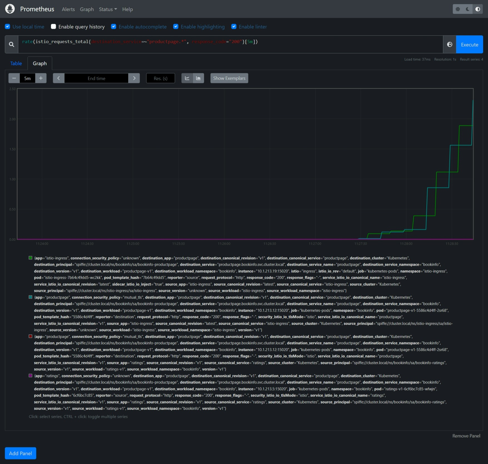

### 2. Distributed traces

Distributed trace spans for each service, providing operators with a detailed understanding of call flows and service dependencies within a mesh.  Distributed tracer supported: [Zipkin, Jaeger, Lightstep, and Datadog](https://istio.io/latest/docs/concepts/observability/#distributed-traces).

Below is an example of Tracing microservices on Jaeger:
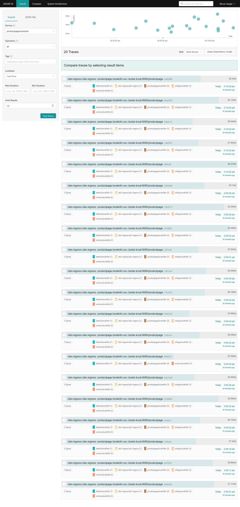

### 3. Access Logs

Istio also provides access logs generated by envoy proxy sidecar.

Below is an example of Access logs:
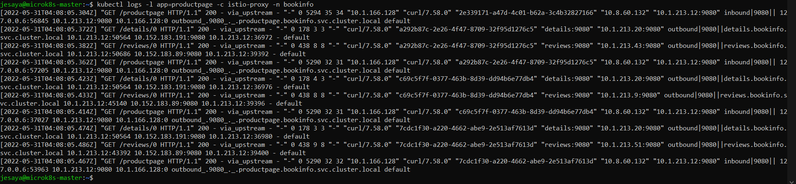

## B. Metrics

### Metrics Overview

Istio generate 3 type metrics:

#### 1. Proxy-level metrics

Metrics generate by Envoy proxy, a side car of proxy used on istio. All metrics on Istio's Envoy are listed on [Statistic Documentation on Envoy Documentation](https://www.envoyproxy.io/docs/envoy/latest/configuration/configuration)

> Note: Not all Envoy metrics are available on Istio proxy-level metrics

* Envoy Proxy metrics showed on Prometheus Metrics Explorer
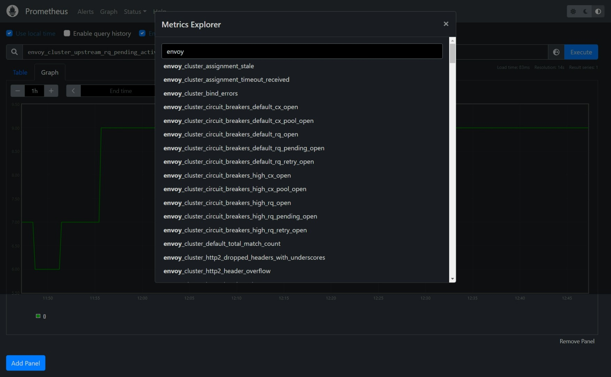
* Querying on Prometheus to get Envoy server uptime in hours
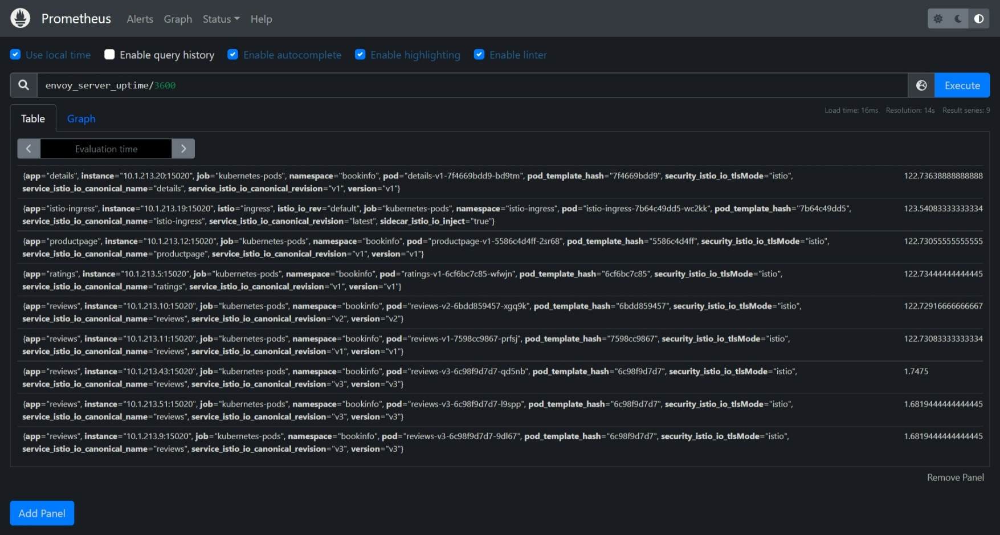

#### 2. Service-level metrics

Service-level metrics is a service oriented metrics to monitor service communication. All Istio service-level metrics are listed on [Istio Standard Metrics Documentation](https://istio.io/latest/docs/reference/config/metrics).

* Querying on Prometheus to get average request duration in milisecond from "productpage" to any destinations except "unknown" every 1 minute.
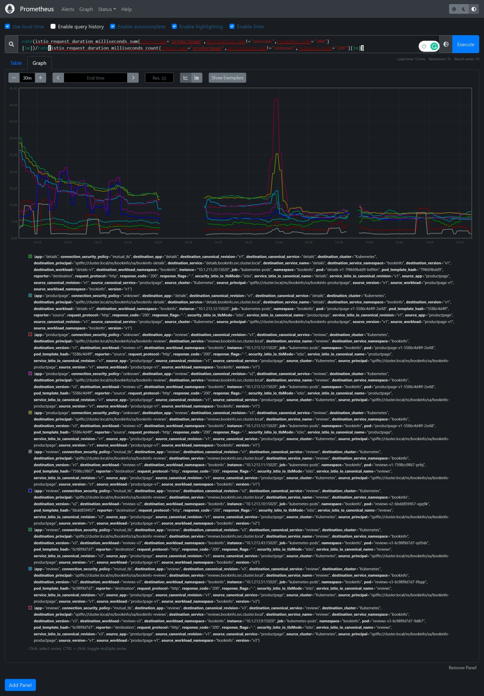

#### 3. Control plane metrics

Self-monitoring metrics to monitor istio behavior. All Istio service-level metrics are listed on [Istio Pilot Metrics Documentation](https://istio.io/latest/docs/reference/commands/pilot-discovery/#metrics).

* Querying on Prometheus to get a number of success sidecar injection requests.
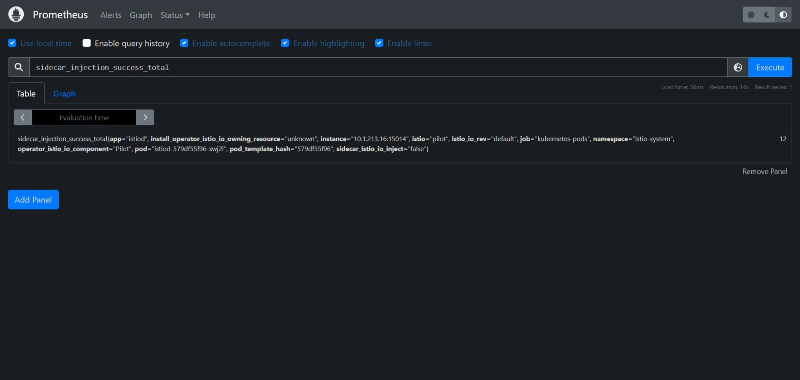

### Installing Prometheus via Helm

> **Make sure Helm is installed. To Install the Helm, see [Installing Helm Documentation](https://helm.sh/docs/intro/install/)**

1. **Add Prometheus chart repository**

    ```bash
    helm repo add prometheus-community https://prometheus-community.github.io/helm-charts
    helm repo update
    ```

1. **Install Prometheus Chart**

    ```bash
    vi prometheus.yaml
    ```

    ```yaml
    alertmanager:
        enabled: false
    nodeExporter:
        enabled: false
    server:
        persistentVolume:
            size: 4Gi
        service:
            servicePort: 9090
            type: NodePort
        global:
            scrape_interval: 15s
    ```

    ```bash
    helm install prometheus prometheus-community/prometheus -n [namespace] --create-namespace -f prometheus.yaml
    ```

## C. Distributed Traces

### Distributed Traces Overview

Distributed Traces provide a way to monitor requests flows lantency/duracy between any microservices dependencies and the app ended the request in Istio service mesh.

* Tracing 1 request to "productpage" with Jaeger.
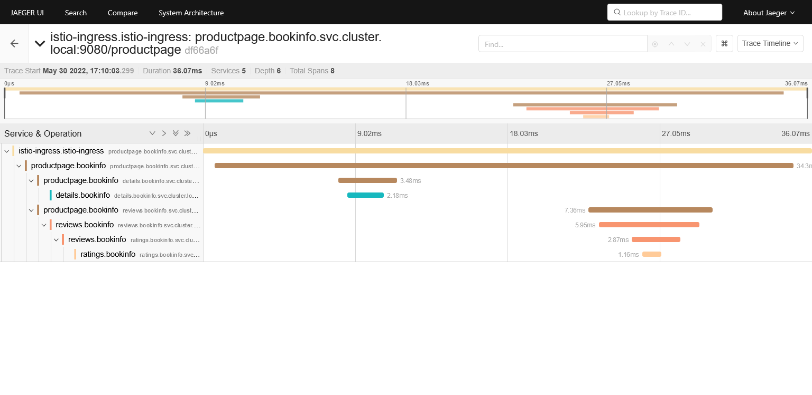

    > Note: On the image, Jaeger using Zipkin API. See [Jaeger Integration - Option 1: Quick Start on Istio Documentation](https://istio.io/latest/docs/ops/integrations/jaeger/#option-1-quick-start) and [Kubernetes file used](https://raw.githubusercontent.com/istio/istio/release-1.13/samples/addons/jaeger.yaml)

* Tracing 1 request to "productpage" with Zipkin.
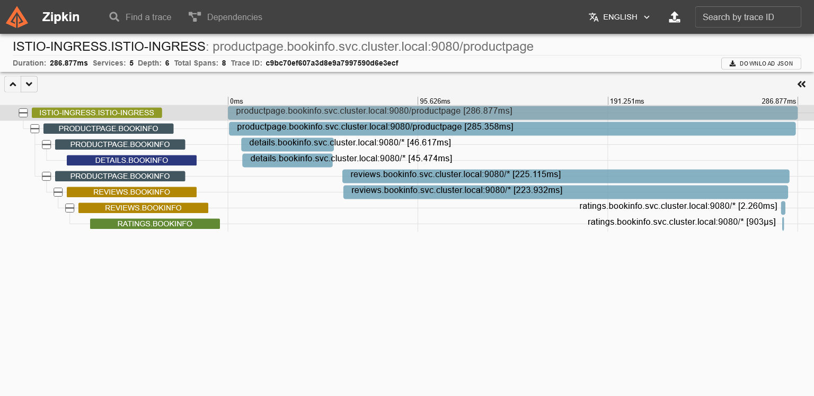

* Tracing "productpage" dependencies with Zipkin.
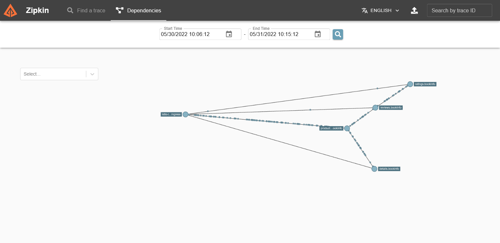

### Installing Jaeger

1. **Apply Quick Start Jaeger Deployment for Istio**

    ```bash
    kubectl apply -f https://raw.githubusercontent.com/istio/istio/release-1.14/samples/addons/jaeger.yaml
    ```

1. **Expose Jaeger with Istio Gateway**

    ```bash
    vi tracing-gateway.yaml
    ```

    ```yaml
    apiVersion: networking.istio.io/v1alpha3
    kind: Gateway
    metadata:
    name: tracing-gateway
    namespace: istio-system
    spec:
    selector:
        istio: ingress
    servers:
    - port:
        number: 80
        name: http-tracing
        protocol: HTTP
        hosts:
        - "[FQDN]"
    ---
    apiVersion: networking.istio.io/v1alpha3
    kind: VirtualService
    metadata:
    name: tracing-vs
    namespace: istio-system
    spec:
    hosts:
    - "[FQDN]"
    gateways:
    - tracing-gateway
    http:
    - route:
        - destination:
            host: tracing
            port:
            number: 80
    ---
    apiVersion: networking.istio.io/v1alpha3
    kind: DestinationRule
    metadata:
    name: tracing
    namespace: istio-system
    spec:
    host: tracing
    trafficPolicy:
        tls:
        mode: DISABLE
    ```

    ```bash
    kubectl apply -f tracing-gateway.yaml
    ```

### Installing Zipkin

1. **Apply Quick Start Zipkin Deployment for Istio**

    ```bash
    kubectl apply -f https://raw.githubusercontent.com/istio/istio/release-1.14/samples/addons/extras/zipkin.yaml
    ```

1. **Expose Zipkin with Istio Gateway**

    ```bash
    vi tracing-gateway.yaml
    ```

    ```yaml
    apiVersion: networking.istio.io/v1alpha3
    kind: Gateway
    metadata:
    name: tracing-gateway
    namespace: istio-system
    spec:
    selector:
        istio: ingress
    servers:
    - port:
        number: 80
        name: http-tracing
        protocol: HTTP
        hosts:
        - "[FQDN]"
    ---
    apiVersion: networking.istio.io/v1alpha3
    kind: VirtualService
    metadata:
    name: tracing-vs
    namespace: istio-system
    spec:
    hosts:
    - "[FQDN]"
    gateways:
    - tracing-gateway
    http:
    - route:
        - destination:
            host: tracing
            port:
            number: 80
    ---
    apiVersion: networking.istio.io/v1alpha3
    kind: DestinationRule
    metadata:
    name: tracing
    namespace: istio-system
    spec:
    host: tracing
    trafficPolicy:
        tls:
        mode: DISABLE
    ```

    ```bash
    kubectl apply -f tracing-gateway.yaml
    ```

## D. Access Logs

### Access Logs Overview

**_(All explanation of this section [has been explained](#3-access-logs))_**

* Logging access logs on envoy proxy at "productpage" service.


* Logging access logs on envoy proxy at "reviews" service.
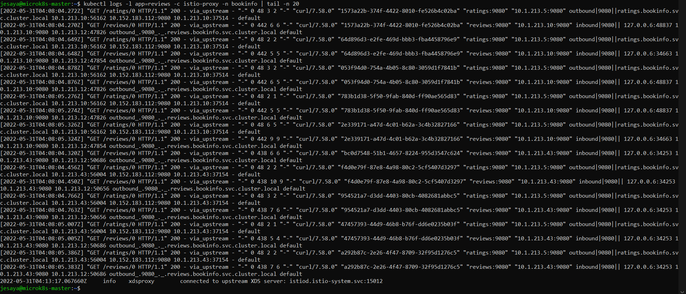

### Enabling Access Logs using Telemetry API

1. **Create _enabling_access_log.yaml_**

    ```bash
    vi access-log/enable-access-log.yaml
    ```

    ```yaml
    apiVersion: telemetry.istio.io/v1alpha1
    kind: Telemetry
    metadata:
        name: mesh-default
        namespace: istio-system
    spec:
    accessLogging:
        - providers:
            - name: envoy
    ```

1. **Apply _enabling_access_log.yaml_ file to installed kubernetes cluster**

    ```bash
    kubectl apply -f enable-access-log.yaml
    ```

1. **Test the results**

    ```bash
    curl [service-istio-injected]
    kubectl get log -l [pod-label] -c envoy-proxy -n [istio-injected-namespace]
    ```

## C. Appendix

1. [ArtifactHub - prometheus-community/prometheus.](https://artifacthub.io/packages/helm/prometheus-community/prometheus)
1. [Helm Documentation - Installing Helm.](https://helm.sh/docs/intro/install/)
1. [Istio Documentation - Bookinfo Application](https://istio.io/latest/docs/examples/bookinfo)
1. [Istio Documentation - Envoy Access Logs.](https://istio.io/latest/docs/tasks/observability/logs/access-log)
1. [Istio Documentation - Installing Guide](https://istio.io/latest/docs/setup/install)
1. [Istio Documentation - Jaeger Integration.](https://istio.io/latest/docs/ops/integrations/jaeger)
1. [Istio Documentation - Observability.](https://istio.io/latest/docs/concepts/observability)
1. [Istio Documentation - Prometheus Integration.](https://istio.io/latest/docs/ops/integrations/prometheus)
1. [Istio Documentation - Querying Metrics from Prometheus](https://istio.io/latest/docs/tasks/observability/metrics/querying-metrics)
1. [Istio Documentation - Zipkin Integration.](https://istio.io/latest/docs/ops/integrations/zipkin)
