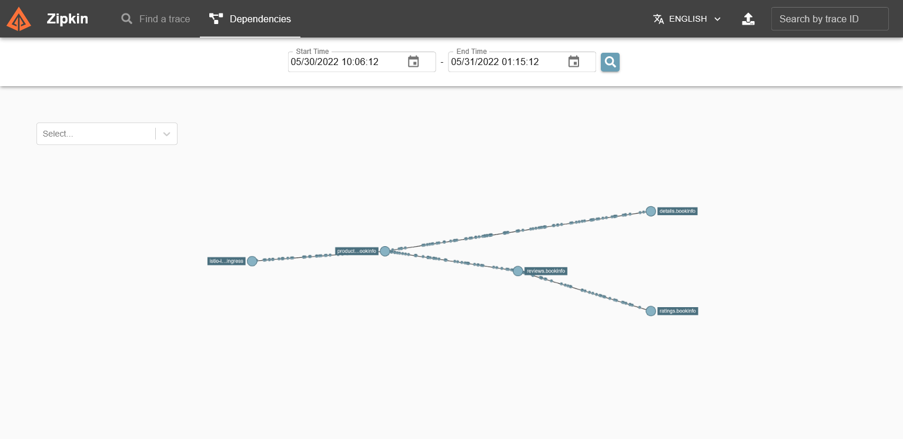

# Istio Observability

## A. Overview

### 1. Metrics

Provide set of metrics based on the four "golden signals" (latency, traffic, errors, saturation). The metrics can be accessed on prometheus installed with [Prometheus Helm chart](https://artifacthub.io/packages/helm/prometheus-community/prometheus) or with following the Istio and Prometheus integration documentation [Istio Documentation - Prometheus Integration - Option 1: Quick Start](https://istio.io/latest/docs/ops/integrations/prometheus/#option-1-quick-start).

Below is an example of Querying on Prometheus to get Istio generated metrics:

### 2. Distributed traces

Distributed trace spans for each service, providing operators with a detailed understanding of call flows and service dependencies within a mesh.  Distributed tracer supported: [Zipkin, Jaeger, Lightstep, and Datadog](https://istio.io/latest/docs/concepts/observability/#distributed-traces). Trace can be implemeted on Jaeger with following [Istio Documentation - Jaeger Integration - Option 1: Quick Start](https://istio.io/latest/docs/ops/integrations/jaeger/#option-1-quick-start) and [Istio Documentation - Zipkin Integration - Option 1: Quick Start.](https://istio.io/latest/docs/ops/integrations/zipkin/#option-1-quick-start) Other installation methods such as Helm and other tools like Lightstep have not been tested.

Below is an example of Tracing microservices on Jaeger:

### 3. Access Logs

Istio also provides access logs (request) generated by envoy proxy. To enable access logs, see [Envoy Access Logs - Enable Envoy's access logging](https://istio.io/latest/docs/tasks/observability/logs/access-log/#enable-envoy-s-access-logging)

Below is an example of Access logs:

## B. Metrics

Istio generate 3 type metrics:

### 1. Proxy-level metrics

Metrics generate by Envoy proxy, a side car of proxy used on istio. All metrics on Istio's Envoy are listed on [Statistic Documentation on Envoy Documentation](https://www.envoyproxy.io/docs/envoy/latest/configuration/configuration)

> Note: Not all Envoy metrics are available on Istio proxy-level metrics

* Envoy Proxy metrics showed on Prometheus Metrics Explorer

* Querying on Prometheus to get Envoy server uptime in hours

### 2. Service-level metrics

Service-level metrics is a service oriented metrics to monitor service communication. All Istio service-level metrics are listed on [Istio Standard Metrics Documentation](https://istio.io/latest/docs/reference/config/metrics).

* Querying on Prometheus to get average request duration in milisecond from "productpage" to any destinations except "unknown" every 1 minute.

### 3. Control plane metrics

Self-monitoring metrics to monitor istio behavior. All Istio service-level metrics are listed on [Istio Pilot Metrics Documentation](https://istio.io/latest/docs/reference/commands/pilot-discovery/#metrics).

* Querying on Prometheus to get a number of success sidecar injection requests.

## C. Distributed Traces

Distributed Traces provide a way to monitor requests flows lantency/duracy between any microservices dependencies and the app ended the request in Istio service mesh.

* Tracing 1 request to "productpage" with Jaeger.

    > Note: On the image, Jaeger using Zipkin API. See [Jaeger Integration - Option 1: Quick Start on Istio Documentation](https://istio.io/latest/docs/ops/integrations/jaeger/#option-1-quick-start) and [Kubernetes file used](https://raw.githubusercontent.com/istio/istio/release-1.13/samples/addons/jaeger.yaml)

* Tracing 1 request to "productpage" with Zipkin.

* Tracing "productpage" dependencies with Zipkin.

## D. Access Logs

**_(All explanation of this section [has been explained](#3-access-logs))_**

* Logging access logs on envoy proxy at "productpage" service.

* Logging access logs on envoy proxy at "reviews" service.

