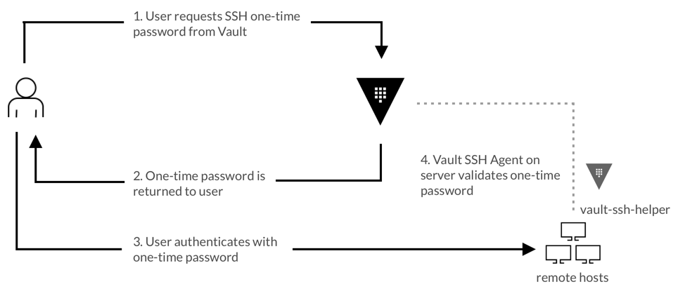

# SSH One-Time Password with Vault

## A. Overview



## B. Prerequisites

* Hashicorp Vault server
* A virtual machine(s)

## C. Steps

### 1. Create SSH secret engine

   > **⚠️ Attention: On Vault CLI and run as root or privilaged user on Vault. ⚠️**
   >
   > **⚠️ Attention: To access remote Vault server, set VAULT_ADDR for Vault Address of Vault and VAULT_SKIP_VERIFY for skip TLS verification⚠️**
   >
   > ```bash
   > export VAULT_ADDR=[vault-address]
   > export VAULT_SKIP_VERIFY=[boolean]
   > ```

```bash
vault secrets enable -path=c ssh
vault write [path-ssh-secret-engine]/roles/[ssh-secret-engine-role-name] key_type=otp default_user=[default-user-of-ssh-server(s)] cidr_list=[cidr-of-ssh-server(s)]
```

### 2. Setup vault-ssh-helper on SSH server(s) machine

> **⚠️ Attention: On SSH server(s) machine and run as user with sudo capabilities. ⚠️**

#### A. Download vault-ssh-helper binary

```bash
sudo apt install -y unzip
wget https://releases.hashicorp.com/vault-ssh-helper/0.2.1/vault-ssh-helper_0.2.1_linux_amd64.zip
sudo unzip -q vault-ssh-helper_0.2.1_linux_amd64.zip -d /usr/local/bin
sudo chmod 0755 /usr/local/bin/vault-ssh-helper
sudo chown root:root /usr/local/bin/vault-ssh-helper
```

#### B. Configure and verify the configuration of vault-ssh-helper binary

```bash
sudo mkdir /etc/vault-ssh-helper.d/
sudo vim /etc/vault-ssh-helper.d/config.hcl
```

```hcl
vault_addr = "[vault-address]"
tls_skip_verify = [boolean]
#if tls_skip_verify = false
ca_cert = "<PEM_ENCODED_CA_CERT>"
ssh_mount_point = "[ssh-secret-engine-path]"
allowed_roles = "*"
```

```bash
vault-ssh-helper -verify-only -config /etc/vault-ssh-helper.d/config.hcl
```

#### C. Configure Pluggable Authentication Module for SSH to using vault-ssh-helper

```bash
# Back-up original file
sudo cp /etc/pam.d/sshd /etc/pam.d/sshd.orig
sudo vim /etc/pam.d/sshd
```

```sshd
# PAM configuration for the Secure Shell service

# Standard Un*x authentication.
#@include common-auth
auth required pam_exec.so quiet expose_authtok log=/var/log/vault-ssh.log /usr/local/bin/vault-ssh-helper -dev -config=/etc/vault-ssh-helper.d/config.hcl
auth optional pam_unix.so not_set_pass use_first_pass nodelay

---omitted---
```

#### D. Configure SSH configuration

```bash
sudo cp /etc/ssh/sshd_config /etc/ssh/sshd_config.orig
sudo vim /etc/ssh/sshd_config
```

Add or set the parameters

```sshd
KbdInteractiveAuthentication yes
UsePAM yes
PasswordAuthentication no
AuthenticationMethods keyboard-interactive
```

   > Older version of Ubuntu use **ChallengeResponseAuthentication** instead of **KbdInteractiveAuthentication**.

```bash
sudo systemctl restart sshd
```

### 3. Test OTP for login to configured SSH server(s)

#### A. Generate OTP

   > **⚠️ Attention: On Vault CLI and run as root or privilaged user on Vault. ⚠️**
   >
   > **⚠️ Attention: To access remote Vault server, set VAULT_ADDR for Vault Address of Vault and VAULT_SKIP_VERIFY for skip TLS verification⚠️**
   >
   > ```bash
   > export VAULT_ADDR=[vault-address]
   > export VAULT_SKIP_VERIFY=[boolean]
   > ```

```bash
vault write [path-ssh-secret-engine]/creds/[ssh-secret-engine-role-name] -ip=[ssh-server-IP-address] -username=[ssh-server-username]

Key                Value
---                -----
lease_id           path-ssh-secret-engine]/creds/[ssh-secret-engine-role-name]/[ssh-secret-engine-cred-id]
lease_duration     768h
lease_renewable    false
ip                 [ssh-server-IP-address]
key                [one-time-password]
key_type           otp
port               22
username           [ssh-username]
```

#### B. Launch SSH connection to configured SSH server(s) and login with OTP

```bash
ssh [ssh-username]@[ssh-server-IP-address]

Password: [one-time-password]
```