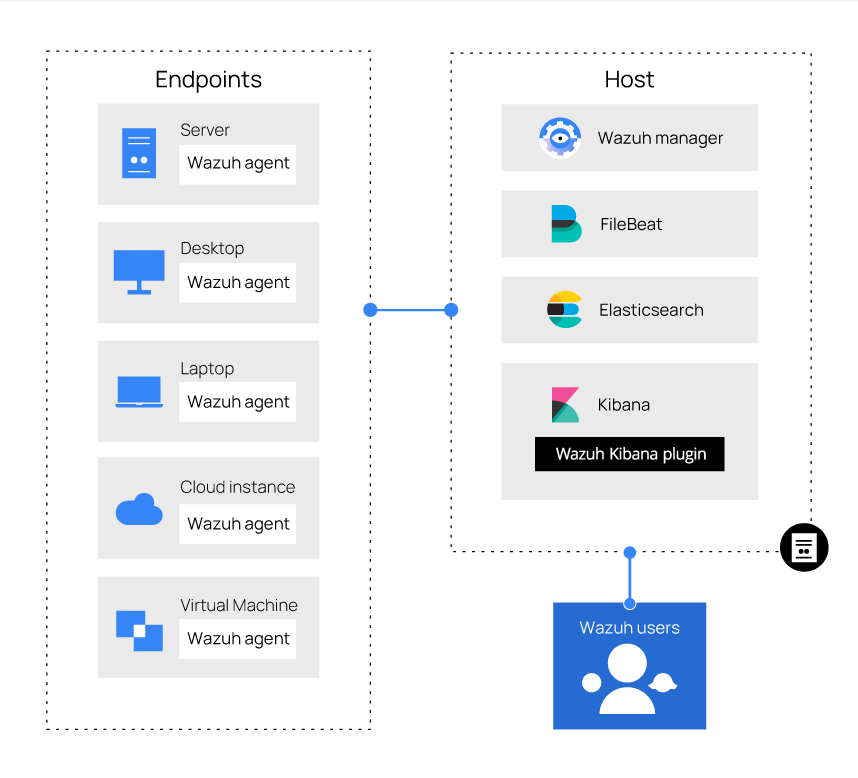
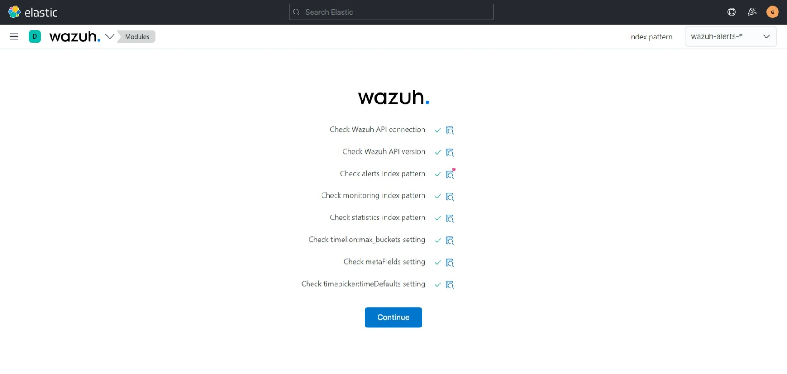
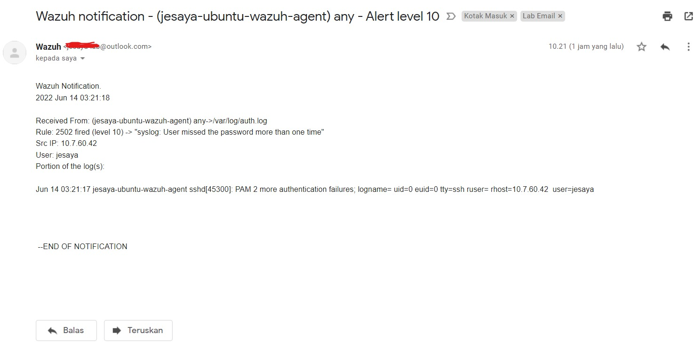

# Wazuh All in One with Elastic and Alert

## A. Overview

### Components will be installed

1. Elasticsearch
1. Filebeat
1. Wazuh module for Filebeat
1. Wazuh Manager
1. Kibana
1. Wazuh plugin for Kibana
1. Postfix
1. Wazuh Agent
1. Hydra

Components number 1-7 will be installed on 1 node as a wazuh server, component number 8 will be installed on every node needed to monitor, component number 9 will be installed on pentest node. 

### High-level architecture



## B. Steps

> **ℹ️ Operating system used is Ubuntu-based.**

### 1. Install Wazuh and Elastic Stack

> **⚠️ Attention: All commands run with privileges.⚠️**
>
> **⚠️ Attention: On Elastic and Wazuh node⚠️**
>
> Run `sudo -i` before run any steps in this section and for exit from `sudo -i` session, run `exit` command or Ctrl+D

#### 1. Add Wazuh and Elastic Stack repository

1. Install prerequisites

    ```bash
    apt-get install apt-transport-https zip unzip lsb-release curl gnupg
    ```

1. Add  repository

    ```bash
    curl -s https://artifacts.elastic.co/GPG-KEY-elasticsearch | apt-key add -
    echo "deb https://artifacts.elastic.co/packages/7.x/apt stable main" | tee /etc/apt/sources.list.d/elastic-7.x.list
    
    curl -s https://packages.wazuh.com/key/GPG-KEY-WAZUH | apt-key add -
    echo "deb https://packages.wazuh.com/4.x/apt/ stable main" | tee -a /etc/apt/sources.list.d/wazuh.list

    apt update
    ```

#### 2. Setup Elasticsearch

1. Install Elasticsearch

    ```bash
    apt install elasticsearch=7.17.4
    ```

1. Configure self-signed certificates for Elasticsearch

    ```bash
    vi /usr/share/elasticsearch/instances.yml
    ```

    ```yaml
    instances:
        - name: [node-hostname]
        ip:
        - [elastic-wazuh-node-ip-address]
    ```

    ```bash
    /usr/share/elasticsearch/bin/elasticsearch-certutil cert ca --pem --in instances.yml --keep-ca-key --out ~/certs.zip
    unzip ~/certs.zip -d ~/certs
    mkdir /etc/elasticsearch/certs/ca -p
    cp -R ~/certs/ca/ ~/certs/elasticsearch/* /etc/elasticsearch/certs/
    chown -R elasticsearch: /etc/elasticsearch/certs
    chmod -R 500 /etc/elasticsearch/certs
    chmod 400 /etc/elasticsearch/certs/ca/ca.* /etc/elasticsearch/certs/elasticsearch.*
    rm -rf ~/certs/ ~/certs.zip
    ```

1. Configure Elasticsearch

    ```bash
    vi /etc/elasticsearch/elasticsearch.yml
    ```

    ```yaml
    network.host: [elastic-wazuh-node-ip-address]
    node.name: [hostname]
    cluster.initial_master_nodes: [hostname]

    # Transport layer
    xpack.security.transport.ssl.enabled: true
    xpack.security.transport.ssl.verification_mode: certificate
    xpack.security.transport.ssl.key: /etc/elasticsearch/certs/elasticsearch.key
    xpack.security.transport.ssl.certificate: /etc/elasticsearch/certs/elasticsearch.crt
    xpack.security.transport.ssl.certificate_authorities: /etc/elasticsearch/certs/ca/ca.crt

    # HTTP layer
    xpack.security.http.ssl.enabled: true
    xpack.security.http.ssl.verification_mode: certificate
    xpack.security.http.ssl.key: /etc/elasticsearch/certs/elasticsearch.key
    xpack.security.http.ssl.certificate: /etc/elasticsearch/certs/elasticsearch.crt
    xpack.security.http.ssl.certificate_authorities: /etc/elasticsearch/certs/ca/ca.crt

    # Elasticsearch authentication
    xpack.security.enabled: true

    path.data: /var/lib/elasticsearch
    path.logs: /var/log/elasticsearch
    ```

1. Run the Elasticsearch service

    ```bash
    systemctl daemon-reload
    systemctl enable elasticsearch
    systemctl start elasticsearch
    ```

1. Generate built-in user password for elasticsearch check elastic user password

    ```bash
    /usr/share/elasticsearch/bin/elasticsearch-setup-passwords auto
    
    ---output ommited--
    Changed password for user elastic
    PASSWORD elastic = [Elastic-password]
    
    curl -XGET https://[elastic-wazuh-node-ip-address]:9200 -u elastic:[Elastic-password] -k
    ```

#### 3. Setup Wazuh Manager

1. Install Wazuh Manager

    ``` bash
    apt install wazuh-manager
    ```

1. Run the Wazuh Manager service

    ``` bash
    systemctl daemon-reload
    systemctl enable wazuh-manager
    systemctl start wazuh-manager
    ```

#### 4. Setup Filebeat

1. Install Filebeat

    ```bash
    apt install filebeat=7.17.4
    ```

1. Configure Filebeat

    ```bash
    vi /etc/filebeat/filebeat.yml
    ```

    ```yaml
    # Wazuh - Filebeat configuration file
    output.elasticsearch.hosts: [elastic-wazuh-node-ip-address]:[elasticsearch-port]
    output.elasticsearch.password: [Elastic-password]

    filebeat.modules:
    - module: wazuh
        alerts:
        enabled: true
        archives:
        enabled: false

    setup.template.json.enabled: true
    setup.template.json.path: /etc/filebeat/wazuh-template.json
    setup.template.json.name: wazuh
    setup.template.overwrite: true
    setup.ilm.enabled: false

    output.elasticsearch.protocol: https
    output.elasticsearch.ssl.certificate: /etc/elasticsearch/certs/elasticsearch.crt
    output.elasticsearch.ssl.key: /etc/elasticsearch/certs/elasticsearch.key
    output.elasticsearch.ssl.certificate_authorities: /etc/elasticsearch/certs/ca/ca.crt
    output.elasticsearch.ssl.verification_mode: strict
    output.elasticsearch.username: elastic
    ```

1. Add alert template

    ```bash
    curl -so /etc/filebeat/wazuh-template.json https://raw.githubusercontent.com/wazuh/wazuh/4.3/extensions/elasticsearch/7.x/wazuh-template.json
    chmod go+r /etc/filebeat/wazuh-template.json
    ```

1. Configure Wazuh module for Filebeat

    ```bash
    curl -s https://packages.wazuh.com/4.x/filebeat/wazuh-filebeat-0.2.tar.gz | tar -xvz -C /usr/share/filebeat/module
    ```

1. Configure self-signed certificates for Filebeat

    ```bash
    cp -r /etc/elasticsearch/certs/ca/ /etc/filebeat/certs/
    cp /etc/elasticsearch/certs/elasticsearch.crt /etc/filebeat/certs/filebeat.crt
    cp /etc/elasticsearch/certs/elasticsearch.key /etc/filebeat/certs/filebeat.key
    ```

1. Run the Filebeat service

    ```bash
    systemctl daemon-reload
    systemctl enable filebeat
    systemctl start filebeat
    ```

1. Test the Filebeat service

    ```bash
    filebeat test output
    ```

    ```output
     elasticsearch: https://[elastic-wazuh-node-ip-address]:[elasticsearch-port]...
      parse url... OK
      connection...
        parse host... OK
        dns lookup... OK
        addresses: 127.0.0.1
        dial up... OK
      TLS...
        security: server's certificate chain verification is enabled
        handshake... OK
        TLS version: TLSv1.3
        dial up... OK
      talk to server... OK
      version: 7.17.4
    ```

#### 5. Setup Kibana

1. Install Kibana

    ```bash
    apt install kibana=7.17.4
    ```

1. Configure self-signed certificates for Kibana

    ```bash
    mkdir /etc/kibana/certs/ca -p
    cp -R /etc/elasticsearch/certs/ca/ /etc/kibana/certs/
    cp /etc/elasticsearch/certs/elasticsearch.key /etc/kibana/certs/kibana.key
    cp /etc/elasticsearch/certs/elasticsearch.crt /etc/kibana/certs/kibana.crt
    chown -R kibana:kibana /etc/kibana/
    chmod -R 500 /etc/kibana/certs
    chmod 440 /etc/kibana/certs/ca/ca.* /etc/kibana/certs/kibana.*
    ```

1. Configure Kibana

    ```bash
    vi /etc/kibana/kibana.yml
    ```

    ```yaml
    server.host: [elastic-wazuh-node-ip-address]
    server.port: [kibana-port]
    elasticsearch.hosts: https://[elastic-wazuh-node-ip-address]:[elasticsearch-port]
    elasticsearch.password: [elasticsearch-password]

    # Elasticsearch from/to Kibana

    elasticsearch.ssl.certificateAuthorities: /etc/kibana/certs/ca/ca.crt
    elasticsearch.ssl.certificate: /etc/kibana/certs/kibana.crt
    elasticsearch.ssl.key: /etc/kibana/certs/kibana.key

    # Browser from/to Kibana
    server.ssl.enabled: true
    server.ssl.certificate: /etc/kibana/certs/kibana.crt
    server.ssl.key: /etc/kibana/certs/kibana.key

    # Elasticsearch authentication
    xpack.security.enabled: true
    elasticsearch.username: elastic
    uiSettings.overrides.defaultRoute: "/app/wazuh"
    elasticsearch.ssl.verificationMode: certificate
    telemetry.banner: false
    ```

    ```bash
    mkdir /usr/share/kibana/data
    chown -R kibana:kibana /usr/share/kibana
    ```

    > **⚠️ Attention ⚠️**
    >
    > The following command will needed only if you are using a [privileged ports or well-known ports (0-1023)](https://superuser.com/questions/710253/allow-non-root-process-to-bind-to-port-80-and-443) for Kibana service

    ```bash
    setcap 'cap_net_bind_service=+ep' /usr/share/kibana/node/bin/node
    ```

1. Configure Wazuh plugin for Kibana

    ```bash
    cd /usr/share/kibana
    sudo -u kibana /usr/share/kibana/bin/kibana-plugin install https://packages.wazuh.com/4.x/ui/kibana/wazuh_kibana-4.3.4_7.17.4-1.zip
    ```

1. Run the Kibana service

    ```bash
    systemctl daemon-reload
    systemctl enable kibana
    systemctl start kibana
    ```

1. Test the Kibana service

    1. Open any browser and visit `https://[elastic-wazuh-node-ip-address]:[kibana-port]`

    1. Login to the Kibana with credential on below:

        ```info
        Username: elastic
        Password: [elasticsearch-password]
        ```

    1. Kibana will health check itself and make sure every component is  healthy ✔️ like screenshot below:

        

### 2. Install Wazuh Agent

> **⚠️ Attention: On accessible node to access Elastic and Wazuh node⚠️**

1. Generate Wazuh Agent installation command

    1. **Open any browser and visit <https://[elastic-wazuh-node-ip-address>]:[kibana-port]**
    1. **Click Three Stripe Icon > Wazuh dropbox > Wazuh > Wazuh dropbox below Elastic logo > Agents > ➕ Deploy new agent above the Agents table**
    1. Choose or fill text field with:

        ```info
        Choose the Operating system: 
        [Red Hat/CentOS, Debian/Ubuntu, Windows, Mac OS]
        Choose the version: 
        (Only for RedHat/CentOS)[CentOS5, CentOS6 or higher, Red Hat 5, Red Hat 6 or higher]
        Choose the architecture:
        (Only for Debian/Ubuntu)[i386, x86_64, armhf, aarch64]
        Wazuh server address:
        [elastic-wazuh-node-ip-address]
        Assign the agent to a group:
        [default-or/and-other-group(s)]
        ```

    1. **Copy generated command on "Install and enroll the agent" section**

        Example:

        ```bash
        curl -so wazuh-agent-4.3.4.deb https://packages.wazuh.com/4.x/apt/pool/main/w/wazuh-agent/wazuh-agent_4.3.4-1_armhf.deb && sudo WAZUH_MANAGER=[elastic-wazuh-node-ip-address] WAZUH_AGENT_GROUP=[default-or/and-other-group(s)] dpkg -i ./wazuh-agent-4.3.4.deb
        ```

    1. Run the command and start the agent on node needed to monitor.

        Example for Linux:

        ```bash
        curl -so wazuh-agent-4.3.4.deb https://packages.wazuh.com/4.x/apt/pool/main/w/wazuh-agent/wazuh-agent_4.3.4-1_amd64.deb && sudo WAZUH_MANAGER=[elastic-wazuh-node-ip-address] WAZUH_AGENT_GROUP=[default-or/and-other-group(s)] dpkg -i ./wazuh-agent-4.3.4.deb

        sudo systemctl daemon-reload
        sudo systemctl enable wazuh-agent
        sudo systemctl start wazuh-agent
        ```

        Example for Windows:

        ```powershell
        Invoke-WebRequest -Uri https://packages.wazuh.com/4.x/windows/wazuh-agent-4.3.4-1.msi -OutFile ${env:tmp}\wazuh-agent-4.3.4.msi; msiexec.exe /i ${env:tmp}\wazuh-agent-4.3.4.msi /q WAZUH_MANAGER=[elastic-wazuh-node-ip-address] WAZUH_REGISTRATION_SERVER=[elastic-wazuh-node-ip-address] WAZUH_AGENT_GROUP=[default-or/and-other-group(s)]

        NET START WazuhSvc
        ```

### 3. Setup SMTP Server and Alert for Wazuh

> **⚠️ Attention: All commands run with privileges.⚠️**
>
> **⚠️ Attention: On Elastic and Wazuh node⚠️**
>
> Run `sudo -i` before run any steps in this section and for exit from `sudo -i` session, run `exit` command or Ctrl+D

#### 1. Configure SMTP Server for Wazuh

1. Install needed packages

    ```bash
    apt install postfix mailutils libsasl2-2 ca-certificates libsasl2-modules
    ```

    Left any configuration in default settings.

1. Configure Postfix

    ```bash
    vi /etc/postfix/main.cf
    ```

    ```cf
    ...output ommited...
    relayhost = [{SMTP_SERVER}]:587
    smtp_sasl_auth_enable = yes
    smtp_sasl_password_maps = hash:/etc/postfix/sasl/sasl_passwd
    smtp_sasl_security_options = noanonymous
    smtp_tls_CAfile = /etc/ssl/certs/ca-certificates.crt
    smtp_use_tls = yes
    ```

    ```bash
    vi /etc/postfix/sasl/sasl_passwd
    ```

    ```passwd
    [{SMTP_SERVER}]:587 [EMAIL_SENDER]:[PASSWORD]
    ```

    ```bash
    postmap /etc/postfix/sasl/sasl_passwd
    chmod 0400 /etc/postfix/sasl/sasl_passwd
    chown root:root /etc/postfix/sasl/sasl_passwd.db
    chmod 0600 /etc/postfix/sasl/sasl_passwd.db
    ```

1. Reload and test configuration

    ```bash
    systemctl reload postfix

    echo "Test mail from postfix" | mail -s "Test Postfix" -r "[EMAIL_SENDER]" [EMAIL_RECEIVER]
    ```

#### 2. Setup email alert

1. Configure Alert on Wazuh

    ```bash
    vi /var/ossec/etc/ossec.conf
    ```

    ```conf
    ...output ommited...
    <ossec_config>
    <global>
        <jsonout_output>yes</jsonout_output>
        <alerts_log>yes</alerts_log>
        <logall>no</logall>
        <logall_json>no</logall_json>
        <email_notification>yes</email_notification>
        <smtp_server>[elastic-wazuh-node-ip-address]</smtp_server>
        <email_from>[EMAIL_SENDER]</email_from>
        <email_to>[EMAIL_RECEIVER]</email_to>
        <email_maxperhour>[maximum_email_per_hour]</email_maxperhour>
        <email_log_source>alerts.log</email_log_source>
        <agents_disconnection_time>10m</agents_disconnection_time>
        <agents_disconnection_alert_time>0</agents_disconnection_alert_time>
    </global>

    <alerts>
        <log_alert_level>3</log_alert_level>
        <email_alert_level>[alert_level(1-12)]</email_alert_level>
    </alerts>
    ...output ommited...
    ```

1. Restart Wazuh Manager service

    ```bash
    systemctl restart wazuh-manager
    ```

1. Test email alert

    > **⚠️ Attention: Make sure <email_alert_level> on level 10 only to test the Wazuh email alert. Restore to needed configuration if email alert is successfully tested.⚠️**

    ```bash
    ssh [installed-wazuh-agent-node-username]@[installed-wazuh-agent-node-ip-address]
    password: [fill with randomly character until ssh connection is reseted]
    ```

    Check the receiver email box and email looks like:
    

## 4. Simulate brute force attacks on installed Wazuh agent node through SSH.

> **⚠️ Attention: On pentest node⚠️**

1. Setup Hydra and list of passwords file

    ```bash
    sudo apt install hydra

    curl -So password.txt https://raw.githubusercontent.com/duyet/bruteforce-database/master/1000000-password-seclists.txt
    ```

2. Launch attack

    ```bash
    hydra -l [installed-wazuh-agent-username] -P password.txt [installed-wazuh-agent-node-ip-address] ssh
    ```

3. Check the impact.

    * On mailbox
    * Security evens on Wazuh plugin on Kibana web-app

## C. Appendix
